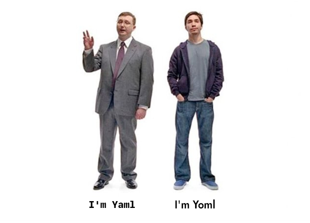

# Yoml



A proof-of-concept demonstrating how to build a yaml parsing library in Rust that gets used via FFI in Ocaml.
🐫 🦀

This project is for funsies. Dunno if it'll become a whole thing or not.

## Overview

Rust dependencies are handled with cargo, but the Ocaml requires some dependencies.

```shell
> opam install ctypes ctypes-foreign pds merlin-of-pds
```

Then clone the repo:
```shell
> git clone https://github.com/jmsdnns/yoml && cd yoml
```

Use the doit script to build both sides and then call the resulting ocaml binary.

```shell
> ./doit.sh

BUILDING RUST
    Finished `dev` profile [unoptimized + debuginfo] target(s) in 0.01s

BUILDING OCAML
make \
OCAMLPATH=/home/jmsdnns/yoml/ocaml/build/release: \
BUILD_DIR=/home/jmsdnns/yoml/ocaml/build/release/yoml \
-C build/release/yoml
make[1]: Entering directory '/home/jmsdnns/yoml/ocaml/build/release/yoml'
make[1]: Nothing to be done for 'all'.
make[1]: Leaving directory '/home/jmsdnns/yoml/ocaml/build/release/yoml'

RUNNING YOML
Parsed: name => ocaml
```

